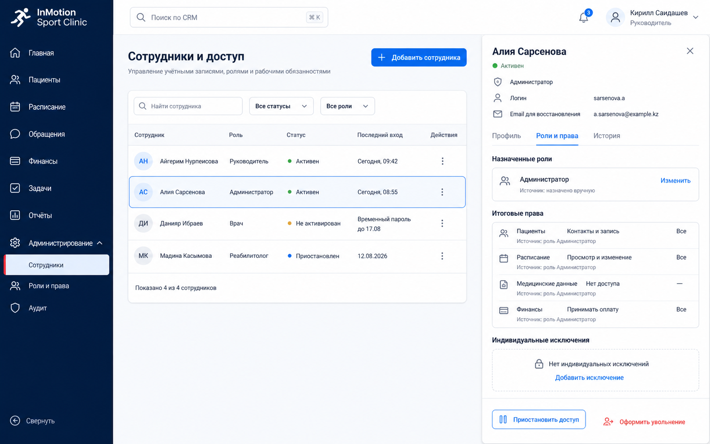

# 004. Авторизация, сотрудники, роли и права

**Этап:** 2. Доступ и каркас приложения

## Цель

Реализовать личные учётные записи и предметную модель доступа CRM.

## Контекст продукта

Шесть базовых ролей дополняются правами на действия, индивидуальными исключениями и областью данных.

Согласованные пограничные решения находятся в
[004-edge-case-decisions.md](004-edge-case-decisions.md). Логин — отдельное
имя пользователя; email применяется только для восстановления доступа.

## Визуальный ориентир

Экран управления сотрудниками использует утверждённую композицию из
:
тёмная навигация слева, верхняя панель, таблица сотрудников и правая карточка
с итоговыми правами. Это ориентир композиции и плотности, а не источник
продуктовых правил или точных токенов — ими управляет `DESIGN.md`.

## Объём

- Интегрировать Supabase Auth без публичной регистрации.
- Реализовать сотрудников, базовые роли, разрешения, области данных и индивидуальные исключения.
- Реализовать временный пароль, обязательную смену, восстановление, блокировки и idle-сессии.
- Реализовать увольнение с обязательным переназначением незавершённой работы.

## Вне объёма

Общие аккаунты, самостоятельная регистрация, пациентские аккаунты.

## Требования

- Backend заново проверяет статус, сессию, права и область данных на каждом запросе.
- Администратор не меняет состав ролей, не повышает права и не назначает руководителя.
- В системе всегда остаётся активный руководитель.
- Refresh token — `HttpOnly Secure` cookie; access token не хранится в `localStorage`; мутации проверяют `Origin`.

## Критерии приёмки

- Пять неуспешных входов блокируют вход на 15 минут; разрешённая разблокировка аудируется.
- За 5 минут до 30-минутного idle-таймаута показано предупреждение; продолжение обновляет сессию.
- Администратор получает контактные/расписательные данные, но не медицинское содержание без права.
- Блокировка последнего руководителя и самоповышение администратора отклоняются backend.
- Увольнение нельзя завершить без переназначения либо подтверждённого исключения; авторство истории сохраняется.
- В списке сотрудников видны безопасные статусы, срок временного пароля и
  происхождение итоговых прав; секреты и пароли в карточку не попадают.

## Зависимости

001–003.

## Примечания по реализации

Supabase Auth хранит credentials и базовую сессию, но не является источником ролей CRM.
